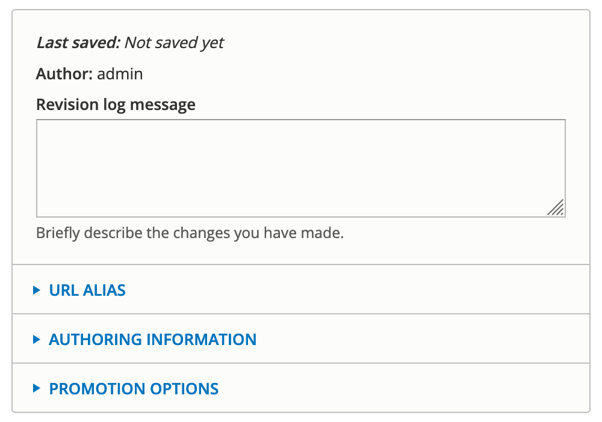

# Restrictions for adding content to the site navigation

When managing content you may discover that some of the content types have an option to be added to the main navigation \(or another\) menu, while others do not.

Try comparing the forms when adding a News and Media content and a Standard Page:

_Right-hand side options in the News and Media form \(left\) and Standard Page \(right\)_

The site builder usually only activates the Menu Settings option for content **that is not listed on the site in any way and can only be found via a navigation menu**. The Standard Page content type is a good example of content that has to be manually added to the main navigation or another menu.

On the other hand, dynamic content such as Events, News or Blog articles do not usually need a link in the main navigation menu, as this content is displayed in the corresponding listing pages. In some cases, the relevancy of content may expire over time \(e.g. Event content types\), so having a link from a menu brings an extra content management burden to remove the link after the content expires.

### Two ways to manage site navigation

There are two methods you can use to add menu items. The exercise below takes you through the two methods, using the example of adding a menu item to the Footer submenu.

#### Exercise 10.1: Add an item to a menu

In this exercise you’ll learn the two methods used to add menu items.

**Method 1:**

This method requires privileged site access \(e.g. an Administrator user\).

1. Go to _Structure → Menus_ and click **Edit menu** for the Footer menu
2. Click **Add Link**
3. Complete the fields
4. Click **Save**
5. Review the changes to the menu in the footer

**Method 2:**

1. Go into a Standard Page and click **Edit**
2. In the RHS click **Menu settings**
3. Click **Provide a menu link**
4. Type in a _Menu link title_
5. Select _Footer_ in the _Parent Item_ dropdown
6. Set _Published_
7. Click **Save**

## 

