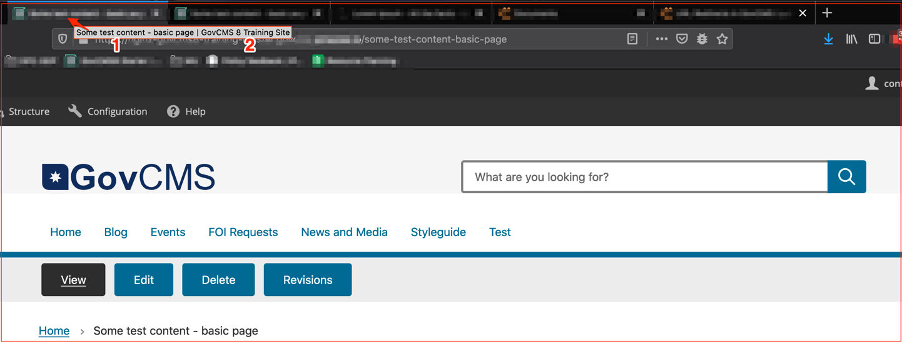

# How tokens are used to populate default meta tags

The search result screenshot above outlines “tokens” that are automatically replaced by GovCMS when content is created or updated. The tokens in use are:

1. \[node:title\] - title of the page
2. \[site:name\] - the name of the site
3. \[node:summary\] - the Summary field of the page or a trimmed Body field, if the Summary field is empty.

#### Exercise 8.1: Update meta tags of content

In this exercise you’ll learn how to update meta tags.

1. Create some Basic page content. Make sure you add some Body content. Do not modify the Meta Tags yet.
2. Publish your page.
3. Using the browser inspector tool \(usually right-click, then Inspect element\), review the &lt;head&gt; of your page. Locate and review the content of tags such as _title_ and _description_ - see below.
4. Discuss any questions with your trainer.

   

5. Edit the page you created in step 1 and update values for the Meta Tags - the _Page title_ and _Description_ fields.
6. Review page source \(as in step 3\) and check how the values of those fields have changed. 

**Hint:** The elements 1 and 2 from the search result screenshot can also be verified by hovering over the browser tab.

## 

